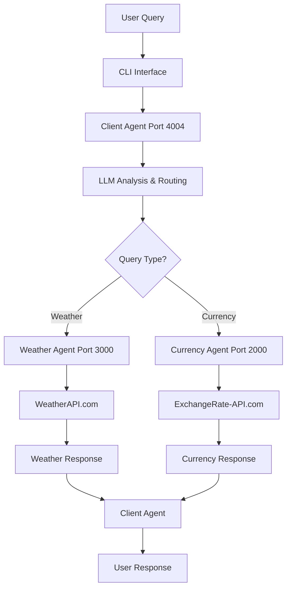

# Multi-Agent A2A System

A sophisticated multi-agent system built using Agent-to-Agent (A2A) communication protocol, featuring specialized agents for weather information and currency conversion. The system demonstrates distributed agent architecture with intelligent query routing and real-time data integration.

## 🏗️ System Architecture

The system consists of three main microservices that communicate using the A2A protocol:

### 1. Client Agent (Orchestrator) [1](#0-0) 

The client agent acts as an intelligent router that:
- Analyzes incoming user queries using a local LLM
- Routes requests to appropriate specialized agents
- Aggregates and returns responses to users
- Runs on port 4004 by default

### 2. Weather Agent [2](#0-1) 

Specialized agent for weather-related queries that:
- Provides current weather information for any location
- Offers weather forecasts up to 5 days
- Integrates with WeatherAPI.com for real-time data
- Uses LangGraph for ReAct pattern implementation
- Runs on port 3000 by default

### 3. Currency Agent [3](#0-2) 

Specialized agent for currency operations that:
- Performs real-time currency conversions
- Provides exchange rates between currencies
- Supports multiple currency rate queries
- Integrates with ExchangeRate-API.com
- Runs on port 2000 by default

## 🛠️ Technology Stack

### Core Framework
- **A2A Protocol**: Agent-to-Agent communication framework
- **LangGraph**: Workflow orchestration and ReAct pattern implementation
- **LangChain**: LLM integration and tool management
- **FastAPI/Starlette**: Web server framework for agent endpoints

### LLM Integration [4](#0-3) 

Custom wrapper for local LLM integration supporting:
- Tool binding and function calling
- Multiple message types (Human, AI, System, Tool)
- Timeout handling and error recovery
- OpenAI-compatible API format

### External APIs [5](#0-4) [6](#0-5) 

## 📋 Prerequisites

### Environment Variables
```bash
# Required for all agents
LOCAL_LLM_API_KEY=your_local_llm_api_key
LOCAL_LLM_MODEL=llama3.3  # optional, defaults to llama3.3

# Optional for enhanced functionality
WEATHER_API_KEY=your_weatherapi_com_key
EXCHANGE_API_KEY=your_exchangerate_api_com_key
```

### Python Dependencies
Based on the imports found in the codebase:
```bash
pip install langchain-core
pip install langgraph
pip install httpx
pip install uvicorn
pip install click
pip install python-dotenv
pip install requests
pip install pydantic
pip install a2a  # Agent-to-Agent framework
```

## 🚀 Installation & Setup

### 1. Clone Repository
```bash
git clone https://github.com/Abisanth21/Multi_Agent_A2A.git
cd Multi_Agent_A2A
```

### 2. Environment Configuration
Create a `.env` file in the root directory:
```bash
LOCAL_LLM_API_KEY=your_api_key_here
LOCAL_LLM_MODEL=llama3.3
WEATHER_API_KEY=your_weather_api_key  # optional
EXCHANGE_API_KEY=your_exchange_api_key  # optional
```

### 3. Install Dependencies
```bash
pip install -r requirements.txt  # if available
# or install manually based on imports
```

## 🎯 Usage

### Starting the System

#### Method 1: Start Individual Agents
```bash
# Terminal 1 - Start Weather Agent
cd weather_agent
python -m weather_agent --host 0.0.0.0 --port 3000

# Terminal 2 - Start Currency Agent  
cd currency_agent
python -m currency_agent --host 0.0.0.0 --port 2000

# Terminal 3 - Start Client Agent
cd client
python -m client --host localhost --port 4004 --weather-agent http://localhost:3000 --currency-agent http://localhost:2000
```

#### Method 2: Using CLI Interface [7](#0-6) 

```bash
# Start the interactive CLI
python cli_interface.py
```

### Example Queries

**Weather Queries:**
- "What's the weather like in New York?"
- "Will it rain tomorrow in London?"
- "Give me a 5-day forecast for Tokyo"

**Currency Queries:**
- "Convert 100 USD to EUR"
- "What's the exchange rate for GBP to JPY?"
- "Show me rates for USD to multiple currencies"

**Multi-domain Queries:**
- "What's the weather in Japan and convert 100 USD to JPY"

## 🔧 Configuration

### Agent Ports [8](#0-7) 

Default ports can be customized:
- Client Agent: 4004
- Weather Agent: 3000  
- Currency Agent: 2000

### LLM Endpoint [9](#0-8) 

The system uses a local LLM endpoint. Update the endpoint URL in the LocalLLMChat class if needed.

## 🏗️ Agent Implementation Details

### Weather Agent Tools [10](#0-9) 

The weather agent implements two main tools:
- `get_current_weather`: Real-time weather data for any location
- `get_weather_forecast`: Multi-day weather forecasts

### Currency Agent Tools [11](#0-10) 

The currency agent provides three tools:
- `get_exchange_rate`: Rate between two specific currencies
- `convert_currency`: Convert amounts between currencies  
- `get_multiple_rates`: Bulk rates from base currency

### Intelligent Routing [12](#0-11) 

The client agent uses keyword-based routing with LLM analysis to determine the appropriate specialized agent for each query.

## 🔍 System Flow



## 🚨 Error Handling

The system includes comprehensive error handling:
- Connection timeout management
- API rate limiting graceful degradation
- Fallback responses for missing API keys
- Agent availability checking [13](#0-12) 

## 🔧 Troubleshooting

### Common Issues:
1. **Agent Connection Failed**: Ensure all three agents are running on their respective ports
2. **API Key Errors**: Weather and currency agents will use mock data if API keys are not configured
3. **LLM Timeout**: Check the local LLM endpoint availability and API key [14](#0-13) 

## 📝 Development Notes

### Architecture Benefits:
- **Modularity**: Each agent can be developed and deployed independently
- **Scalability**: Easy to add new specialized agents
- **Fault Tolerance**: Agents can operate with degraded functionality
- **Extensibility**: Simple to add new tools and capabilities

### Future Enhancements:
- Add more specialized agents (e.g., news, stock prices)
- Implement agent discovery and registration
- Add authentication and rate limiting
- Create web interface for better user experience

## Notes

This multi-agent system demonstrates a sophisticated approach to distributed AI services using the A2A protocol. The modular architecture allows for easy expansion and maintenance, while the intelligent routing ensures users get responses from the most appropriate specialized agent. The system gracefully handles API failures and provides mock data when external services are unavailable, making it robust for development and testing scenarios.

